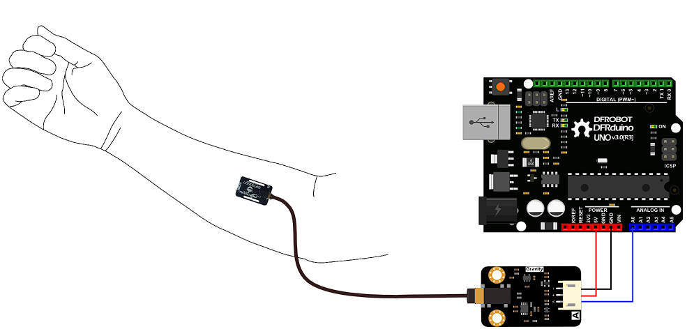

# EMG & Motion Detection System

## This repository contains the code and instructions for developing a real-time EMG (electromyography) and motion detection system using Arduino and Python/OpenCV. The system is designed to measure, monitor, and manage muscle signals, aiming to assist in muscle injury rehabilitation. It is suitable for athletes and non-expert users.

## Features
- Real-time EMG signal acquisition using commercial sEMG sensors
- Signal processing and analysis via Python
- Motion detection and tracking using OpenCV

## Hardware Requirements
- Arduino board (e.g., Arduino Mega)
- Commercial sEMG sensor (I used the [Gravity Emg sensor](https://www.dfrobot.com/product-1661.html))
- Electrodes (Usually they are includded with the EMG sensor)
- Motion capture camera(U can use any webcam)

## Software Requirements
- Arduino IDE
- Python 3.x
- OpenCV library for Python (opencv-python)

## Installation
1. Arduino Setup
    - Open the Arduino sketch in Arduino IDE.
    - Connect the EMG sensor to Arduino.

    
    - Upload the code.

2. Python Environment

    - Install Python 3.x
    - Install required libraries:
    ```bash
    pip install opencv-python numpy matplotlib
    ```
    - Run the Python scripts to start signal processing and motion detection.


## Usage
1. Connect the EMG sensor to the Arduino and place electrodes on the target muscle.
2. Run the Arduino sketch to start streaming EMG data.
3. Launch the Python script to process the EMG data and track motion using the camera.
4. Observe live feedback of muscle activity and motion, and save data for further analysis

